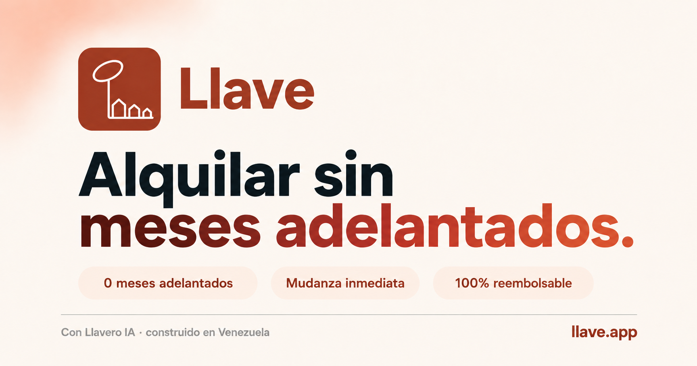

# Platanus Build Night ft. Anthropic

## 2026 - Caracas, Venezuela

---

This is the code repository for raor00 at Platanus Build Night 26, in Caracas.

* Full name: Rafael Alejandro Oviedo Rojas
* Github username: raor00

Remember you should push the code before the deadline and make sure its deployed.

Good luck 🍌🚀

---

<p align="center">
  
</p>

# Llave — Alquila en 24 horas. Sin papeles que no tienes.

Plataforma venezolana de alquileres con `Llavero`, un agente IA construido sobre Claude que acepta a quien el modelo tradicional excluye: trabajadores informales, freelancers, estudiantes y la diáspora venezolana.

🌐 **Demo en vivo**: <https://llave-ruby.vercel.app>

---

## Qué hace Llave distinto

Otros prometen "sin meses adelantados" pero en la letra chica piden RIF, constancia de trabajo, movimientos bancarios y dos semanas de espera. El 60% de la economía informal de Venezuela queda afuera. Llave entra por esa grieta.

- **Solo cédula** para alquilar — sin RIF, sin constancia de trabajo, sin movimientos bancarios.
- **24 a 48 horas** desde el primer chat hasta las llaves en mano (vs 1-2 semanas de la competencia).
- **Trust Score progresivo** — tu reputación se construye pagando, no presentando papeles. Exportable como credencial verificable para banca futura.
- **Tour 3D Gaussian Splat** — recorré el inmueble desde Madrid, Bogotá, Buenos Aires o Miami antes de tomar un vuelo.
- **Llavero IA** — un agente que entiende contexto, no formularios.
- **CRM unificado** para asesores — captación móvil con cámara, publicación con IA, leads pre-calificados, redes sociales y Meta Ads en un panel.

## Documentación

Toda la documentación detallada vive en [`docs/`](./docs/README.md):

- [Arquitectura](./docs/architecture.md) · [Rutas](./docs/routes.md) · [Modelo de datos](./docs/data-model.md)
- [Agente Llavero](./docs/agent-llavero.md) · [Branding](./docs/branding.md)
- [Desarrollo](./docs/development.md) · [Testing](./docs/testing.md) · [Deployment](./docs/deployment.md)
- [Seguridad](./docs/security.md) · [Roadmap](./docs/roadmap.md)
- [Anatomía del logo](./docs/logo-anatomy.md) · [Estrategia de marca](./docs/brand-strategy.md)
- [Workflow de captura 3D](./docs/3d-capture-workflow.md) · [Testing manual](./docs/testing-flow.md)
- [Handoff prompt para retomar](./docs/handoff-prompt.md)

Para contributors (humanos o agentes): `.claude/skills/llave/SKILL.md` se carga automáticamente y trae el contrato completo del proyecto. Además [`AGENTS.md`](./AGENTS.md) es el punto de entrada agnóstico para cualquier asistente IA (Claude Code, Codex, Cursor, Gemini CLI, OpenCode).

## Stack

- Next.js 16 App Router + Turbopack + React 19 + TypeScript strict
- Vercel AI SDK v6 + `@ai-sdk/anthropic` (Claude Sonnet 4.5)
- Supabase SSR (Postgres + RLS + Storage) con seed in-memory fallback
- Tailwind v4 (terracota caribeño `#c4513a`)
- React Three Fiber + drei (escenas 3D)
- gsplat (Gaussian Splat viewer, tipo SuperSplat) + Maplibre (mapa) + `<model-viewer>` (USDZ/GLB)
- Motion (Framer Motion v12) — animaciones scroll-driven en la landing
- Web Speech API — modo voz nativo en `/chat`
- Vitest + happy-dom — 29 aserciones

## Setup local

```bash
pnpm install
cp env.example .env.local
# edita .env.local con tu ANTHROPIC_API_KEY
pnpm dev
```

Sin Supabase, la app funciona con seed in-memory de 17 inmuebles. Sin key de IA, Llavero usa un parser local de intents que igual llama a las tools reales.

### Variables de entorno

| Variable | Requerida | De dónde sale |
|----------|-----------|---------------|
| `ANTHROPIC_API_KEY` | sí (preferida) | console.anthropic.com → API Keys |
| `AI_GATEWAY_API_KEY` | alterna | vercel.com → AI Gateway (requiere tarjeta) |
| `LLAVE_OFFLINE` | opcional | `1` fuerza el mock determinista |
| `NEXT_PUBLIC_SUPABASE_URL` | opcional | vercel.com → Marketplace → Supabase |
| `NEXT_PUBLIC_SUPABASE_ANON_KEY` | opcional | mismo lugar |
| `SUPABASE_SERVICE_ROLE_KEY` | opcional | mismo lugar (server-only) |

Más detalle en [docs/deployment.md](./docs/deployment.md).

## Scripts

```bash
pnpm dev          # dev server (Turbopack)
pnpm test         # Vitest (29 aserciones, 3 suites)
pnpm test:watch
pnpm typecheck    # tsc --noEmit
pnpm build        # build de producción
pnpm lint         # ESLint
```

## Deploy

```bash
vercel link
vercel env add ANTHROPIC_API_KEY production
vercel env add NEXT_PUBLIC_SUPABASE_URL production
vercel env add NEXT_PUBLIC_SUPABASE_ANON_KEY production
vercel env add SUPABASE_SERVICE_ROLE_KEY production
vercel deploy --prod
```

## Estructura

```
src/
  app/
    page.tsx                 → Landing (motion + comparativa anti-Quarto)
    buscar/                  → Marketplace con lista/mapa + comparador
    inmueble/[id]/           → Detalle con galería + Tour 3D Gaussian Splat
    chat/                    → Llavero IA con voz + tools inline
    onboarding/              → Onboarding por rol (form o vía chat)
    inquilino/               → Dashboard inquilino + Trust Score
    asesor/                  → CRM (dashboard, captación, leads, publicar)
    propietario/             → Dashboard propietario (ocupación, leads)
    login/                   → Supabase magic link
    api/chat/route.ts        → AI SDK streamText + 8 tools
    opengraph-image.tsx      → OG dinámica
    icon.png                 → Favicon estático
  components/
    landing/                 → fade-in, scroll-progress, crm-mockup, hero-3d (legado)
    chat/                    → chat-window + tool-result + use-voice
    marketplace/             → cards, filtros, mapa, comparador, tour-3d, splat-viewer
    asesor/                  → sidebar + command-palette + captación
  lib/
    ai/system-prompt.ts      → Personalidad Llavero (Venezolano tuteo)
    ai/tools.ts              → 8 tools Zod (incluye setupMyProfile)
    ai/local-mock-model.ts   → Fallback offline
    db/queries.ts            → Supabase + seed fallback
    db/seed-data.ts          → 17 inmuebles VE
supabase/migrations/         → Schema + seed SQL con RLS
docs/                        → Documentación completa
tests/                       → Vitest
.claude/skills/llave/        → Skill del proyecto (auto-load)
```

## Roadmap

Próximas etapas (LiDAR nativo, contratos digitales, Trust Score exportable a banca, onboarding remoto para diáspora con identidad verificada, integración Meta Ads en vivo) en [docs/roadmap.md](./docs/roadmap.md).
