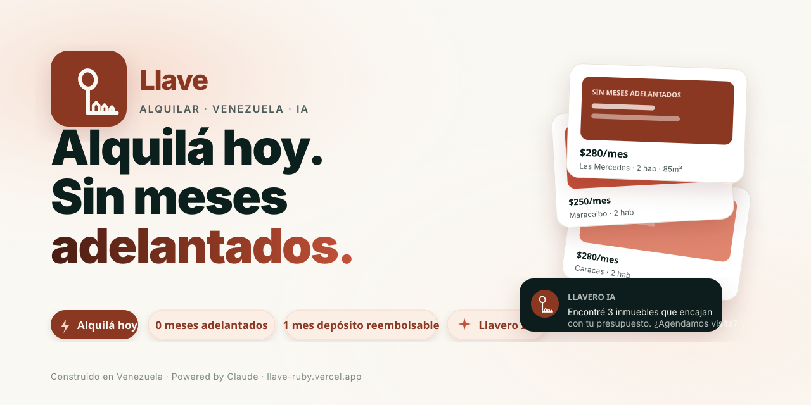

<p align="center">
  
</p>

# Llave — Alquilar sin meses adelantados

Plataforma venezolana de alquileres con `Llavero`, un agente de IA que rompe la fricción del modelo tradicional (meses adelantados + depósito + administrativo + comisión). Construida en el **Platanus Build Night ft. Anthropic** (Caracas, 2026).

🌐 **Demo en vivo**: <https://llave-ruby.vercel.app>
📦 **Repo público (mirror)**: <https://github.com/raor00/llave>

---

## Participante — Platanus Build Night ft. Anthropic

- **Edición**: 2026 · Caracas, Venezuela
- **Nombre completo**: Rafael Alejandro Oviedo Rojas
- **GitHub**: [@raor00](https://github.com/raor00)
- **Proyecto**: Llave 🗝️ — marketplace de alquileres con agente IA

🍌🚀

---

---

## Documentación

Toda la documentación detallada vive en [`docs/`](./docs/README.md):

- [Arquitectura](./docs/architecture.md) · [Rutas](./docs/routes.md) · [Modelo de datos](./docs/data-model.md)
- [Agente Llavero](./docs/agent-llavero.md) · [Branding](./docs/branding.md)
- [Desarrollo](./docs/development.md) · [Testing](./docs/testing.md) · [Deployment](./docs/deployment.md)
- [Seguridad](./docs/security.md) · [Roadmap](./docs/roadmap.md)

Para contributors (humanos o agentes Claude futuros): `.claude/skills/llave/SKILL.md` se carga automáticamente y trae el contrato completo del proyecto.

---

## Qué hace

- **Marketplace real** — 17 inmuebles VE, filtros por ciudad/tipo/precio/ambientes, vista lista o mapa, comparador (hasta 4).
- **Llavero (agente IA)** — 7 tools que tocan la DB real: `searchProperties`, `getPropertyDetail`, `recommendByProfile`, `compareProperties`, `scheduleVisit`, `createPropertyDraft`, `suggestPrice`. Modo voz opcional (dictado + síntesis).
- **CRM asesor** — dashboard con stats, leads recibidos por el agente, publicar inmueble asistido por IA.
- **Landing 3D** — hero con casa procedural + llave flotante que rota con scroll.
- **Modelo Llave** — sin meses adelantados, depósito reducido reembolsable, garantía al propietario, reputación que vale.

## Stack

- Next.js 16 (App Router + Turbopack)
- React 19
- Vercel AI SDK v6 + Anthropic Claude Sonnet 4.5 (directo) — con fallback a AI Gateway y mock determinista
- Supabase (SSR auth + Postgres + Storage) — fallback a seed JSON cuando faltan envs
- React Three Fiber + drei (hero 3D)
- Maplibre GL (mapa de inmuebles)
- Tailwind v4 (tema custom emerald + crema)
- Web Speech API (modo voz)

## Setup local

```bash
pnpm install
cp env.example .env.local
# editá .env.local con tu ANTHROPIC_API_KEY
pnpm dev
```

Sin Supabase, la app funciona con seed in-memory. Sin key de IA o con `LLAVE_OFFLINE=1`, Llavero usa un parser local de intents que igual llama tools reales.

### Variables de entorno mínimas

| Variable | Requerida | De dónde sale |
|----------|-----------|---------------|
| `ANTHROPIC_API_KEY` | sí (preferida) | console.anthropic.com → API Keys |
| `AI_GATEWAY_API_KEY` | alterna | vercel.com → AI Gateway (requiere tarjeta) |
| `LLAVE_OFFLINE` | opcional | `1` fuerza el mock local |
| `NEXT_PUBLIC_SUPABASE_URL` | opcional | vercel.com → Marketplace → Supabase |
| `NEXT_PUBLIC_SUPABASE_ANON_KEY` | opcional | mismo lugar |

Más detalle en [docs/deployment.md](./docs/deployment.md).

## Scripts

```bash
pnpm dev          # dev server
pnpm test         # Vitest (29 aserciones, 3 suites)
pnpm test:watch
pnpm typecheck    # tsc --noEmit --skipLibCheck
pnpm build        # build de producción
pnpm lint         # ESLint
```

## Deploy

```bash
vercel link
vercel env add ANTHROPIC_API_KEY production
vercel deploy --prod
```

## Estructura

```
src/
  app/
    page.tsx                 → Landing
    buscar/                  → Marketplace
    inmueble/[id]/           → Detalle
    chat/                    → Llavero (UI completa)
    asesor/                  → CRM demo (dashboard, leads, publicar)
    login/                   → Supabase magic link
    api/chat/route.ts        → AI SDK streamText + tools
    opengraph-image.tsx      → OG dinámica
    icon.tsx                 → Favicon dinámico
  components/
    landing/hero-3d.tsx      → Casa procedural R3F
    chat/chat-window.tsx     → Chat con voz + tools inline
    chat/tool-result.tsx     → Render por tipo de tool
    marketplace/             → cards, filtros, mapa, comparador
  lib/
    ai/system-prompt.ts      → Personalidad Llavero
    ai/tools.ts              → Tools Zod-typed
    ai/local-mock-model.ts   → Fallback offline
    db/queries.ts            → Supabase + fallback seed
    db/seed-data.ts          → 17 inmuebles VE
supabase/migrations/         → Schema + seed SQL
docs/                        → Documentación completa
tests/                       → Vitest
.claude/skills/llave/        → Skill del proyecto
```

## Roadmap

Las próximas etapas (LiDAR 3D, contratos digitales, Llave Score, Meta Ads) viven en [docs/roadmap.md](./docs/roadmap.md).
